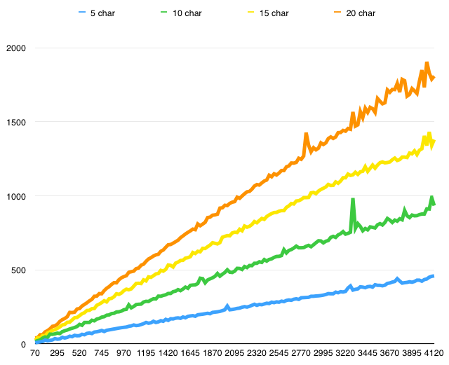

# fuzziac.js
Fuzziac.js is JavaScript class for on-line approximate string matching. It was originally intended for use with auto-complete, such as that provided by jQuery UI. This is started as a research project for an undergraduate algorithms class which I took way back in 2011. We had to complete a term project on an algorithm, and Dr. Duan made dynamic programming look cool, so I though I would look for an application of dynamic programming outside the realm of DNA sequencing.

If you would like to know the full story on how I came to develop this solution you can read the post I wrote about the [history of fuzziac.js][fuzziacpost], or you can read my [original research paper][fuzziacresearch].

## What Does it Do?
It takes a horribly mispelled (or phonetically mispelled) name and suggests the best fitting one it can find from your list of supplied names (from you user or employee list). It can be used for other strings besides names as well, as long as the search string is relatively short (less than 20 characters) and the list of possibilities is not too long (less than 1000 choices).



## Usage
To use fuzziac.js to compare two strings (stringB and stringC) to a master string (stringA):

```html
<script type="text/javascript" src="./fuzziac.js"></script>
<script type="text/javascript">
	var nm = {},
		stringA = 'Johnny Appleseed',
		stringB = 'John Apples',
		stringC = 'Jon Appleton',
		finalScore = 0;

	nm = new fuzziac(stringA);
	finalScore = nm.score(stringB);
	finalScore = nm.score(stringC);
</script>
```

To compare stringB to stringA and then output the debug matrix into `#test_table`:

```html
<script type="text/javascript" src="./fuzziac.js"></script>
<script type="text/javascript">
	var nm = {},
		stringA = 'Johnny Appleseed',
		stringB = 'John Apples',
		finalScore = 0;

	nm = new fuzziac(stringA, true, '#test_table');
	nm.score(stringB);
</script>
```

To compare a string (a name entered into an autocomplete box) to an array of special character-free name strings (stored here in names.js, but which should probably come from a JSON API):

```html
<script type="text/javascript" src="//code.jquery.com/jquery-1.10.2.js"></script>
<script type="text/javascript" src="//code.jquery.com/ui/1.10.4/jquery-ui.js"></script>
<script type="text/javascript" src="./fuzziac.js"></script>
<script type="text/javascript" src="./names.js"></script>
<script type="text/javascript">
	var nm = {},
		resultArray = [];
	
	function findName(pName){
		nm = new fuzziac(pName);
		return nm.topMatchesFromArray(allNames);
	}
	
	$(document).ready(function(){
		$("#searchbox").autocomplete({
			minLength: 3,
			source: function(request, response) {
				response(
					findName(request.term)
				);
			}
		});
	});
</script>
```

The autocomplete function of the current jQuery UI seems to be slower than the version I originally used in 2011. Perhaps the technique I am using is outdated. I am working on improving fuzziac.js to handle larger data sets, then I'll check on the autocomplete. Fuzziac.js should run in O(n), but the overhead constants are quite large, so you probably only want to use fuzziac with arrays of less about 1000 name strings. The list I am using here has over 4,000 entries, which is too large for production use, but it gives my machine a challenge.


[fuzziacpost]: http://christopherstoll.org/2014/01/24/fuzziac-javascript-string-matching.html
[fuzziacresearch]: analysis/2011-11_FinalProjectReport.pdf
